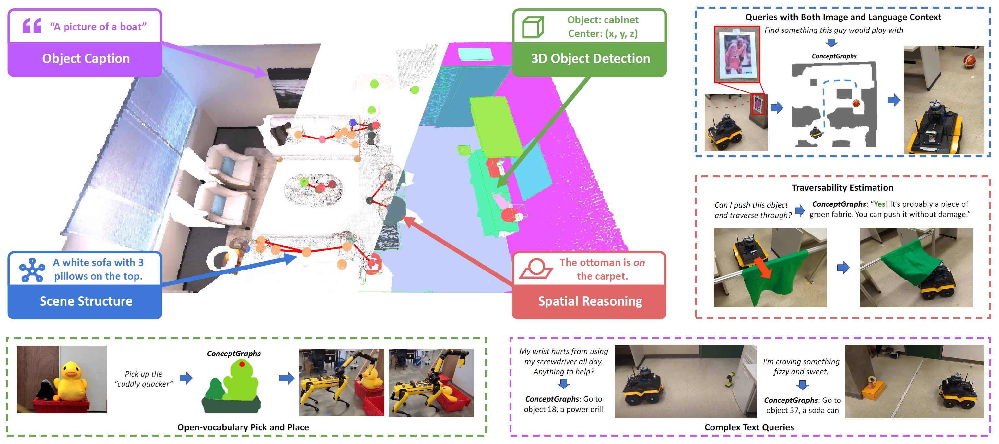

# ConceptGraphs: Open-Vocabulary 3D Scene Graphs for Perception and Planning

This repository contains the code for the ConceptGraphs project. ConceptGraphs builds open-vocabulary 3D scenegraphs that enable a broad range of perception and task planning capabilities.

[**Project Page**](https://concept-graphs.github.io/) |
[**Paper**](https://concept-graphs.github.io/assets/pdf/2023-ConceptGraphs.pdf) |
[**ArXiv**](https://arxiv.org/abs/2309.16650) |
[**Video**](https://www.youtube.com/watch?v=mRhNkQwRYnc&feature=youtu.be&ab_channel=AliK)


[Qiao Gu](https://georgegu1997.github.io/)\*,
[Ali Kuwajerwala](https://www.alihkw.com/)\*,
[Sacha Morin](https://sachamorin.github.io/)\*,
[Krishna Murthy Jatavallabhula](https://krrish94.github.io/)\*,
[Bipasha Sen](https://bipashasen.github.io/),
[Aditya Agarwal](https://skymanaditya1.github.io/),
[Corban Rivera](https://www.jhuapl.edu/work/our-organization/research-and-exploratory-development/red-staff-directory/corban-rivera),
[William Paul](https://scholar.google.com/citations?user=92bmh84AAAAJ),
[Kirsty Ellis](https://mila.quebec/en/person/kirsty-ellis/),
[Rama Chellappa](https://engineering.jhu.edu/faculty/rama-chellappa/),
[Chuang Gan](https://people.csail.mit.edu/ganchuang/),
[Celso Miguel de Melo](https://celsodemelo.net/),
[Joshua B. Tenenbaum](http://web.mit.edu/cocosci/josh.html),
[Antonio Torralba](https://groups.csail.mit.edu/vision/torralbalab/),
[Florian Shkurti](http://www.cs.toronto.edu//~florian/),
[Liam Paull](http://liampaull.ca/)



## Getting Started Video Tutorial 

This 1.5 hours long Youtube video is detailed getting started tutorial covering the README below as of May 7, 2024. In it, I start with a blank ubuntu 20.04, and setup ConceptGraphs, and make a map using the replica dataset and an iPhone scan. Also covers the direct streaming option! I decided to be extra detailed just in case, so feel free to skip over / through the parts that are too slow for you.

[](https://www.youtube.com/watch?v=56jEFyrqqpo)

<details >
<summary>Video Chapters (Dropdown) </summary>
<br>
  
0:00 Welcome Introduction

1:09 Tutorial Starts

1:58 Download Dataset

3:17 Conda Env Setup Starts

9:32 Setting CUDA_HOME env variable

14:18 Install ali-dev ConceptGraphs into conda env

16:39 Build map w Replica Dataset starts

18:38 Weird Indent Error

19:27 Config Setup and Related Errors Explanation starts

21:13 Hydra Config Composition explained

25:00 Setting repo_root and data_root in base_paths YAML

27:25 Initial Overview of mapping script

29:02 Changing SAM to MobileSAM

30:27 Commenting out openai api for now

31:48 Overview of changes so far

32:09 Initial look at Rerun window

33:44 Overview of changes so far part 2

35:01 Stopping the map building early explained

35:32 Saving the Rerun data

37:52 Saving the map

38:33 last_pcd_save Symbolic Link Explained

39:42 Exploring the Finished Experiment Folder

42:40 Saved param file for the Experiment

45:00 Searching the map with natural language queries

48:42 Overview of changes so far part 3

50:10 Reusing detections

52:21 Showing off Rerun Visualization features

54:43 Incomplete Dataset Reuse Issue

55:38 Summary and Recap So far

56:19 Using an iPhone as RGB-D sensor starts

56:46 Record3D app explained

57:49 Setting up and extracting r3d file dataset

59:31 Preprocessing extracted r3d dataset 

1:01:42 Missing dependencies fix 

1:04:31 Building and saving  map with iPhone dataset

1:09:41 Searching the co_store map with natural language queries

1:10:56 Streaming data directly from iPhone explanation starts 

1:14:10 Installing record3D git repo and cmake

1:18:29 setting up OpenAI API key env variable  

1:20:03 Streaming directly from iPhone working 

1:22:21 Searching the streamed iPhone map with natural language queries

1:23:41 Edges explanation starts

1:24:58 Building a map with edges and using the VSCode Debugger starts

1:25:22 Explaining the VSCode launch.json debug config

1:27:21 Building a map with Edges

1:29:17 Summary and recap of video and changes so far

1:30:28 High level overview of main mapping script

1:35:19 How to use the VSCode debugger

1:37:12 Summary and recap of video and changes so far part 2

1:37:49 Outro and goodbye

</details>


## Installation

### Code

ConceptGraphs is built using Python. We recommend using [Anaconda](https://www.anaconda.com/download) to manage your python environment. It creates a separate environment for each project, which is useful for managing dependencies and ensuring that you don't have conflicting versions of packages from other projects.

**NOTE:** Sometimes certain versions of ubuntu/windows, python, pytorch and cuda may not work well together. Unfortunately this means you may need to do some trial and error to get everything working. We have included the versions of the packages we used on our machines, which ran Ubuntu 22.04.

To create your python environment, run the following commands:

```bash
# EITHER: use the mamba environment with ROS2 from https://github.com/123orrin/ros2_orbbec_slam
mamba activate ros_cg

# Add ros2_numpy for converting numpy to ROS 2 messages
export ROS2_WS  # The location of your ROS 2 workspace if you haven't created this already. Add this to your bashrc
cd $ROS2_WS
source install/setup.bash

# OR: Create the mamba environment (you can find the instructions for installing mamba here: https://github.com/conda-forge/miniforge)
mamba create -n conceptgraph python=3.10
mamba activate conceptgraph

##### Install Pytorch according to your own setup #####
# For example, if you have a GPU with CUDA 11.8 (We tested it Pytorch 2.0.1)
mamba install pytorch==2.0.1 torchvision==0.15.2 torchaudio==2.0.2 pytorch-cuda=11.8 -c pytorch -c nvidia

# Install the Faiss library (CPU version should be fine), this is used for quick indexing of pointclouds for duplicate object matching and merging
mamba install -c pytorch faiss-cpu=1.7.4 mkl=2021 blas=1.0=mkl

# Install Pytorch3D (https://github.com/facebookresearch/pytorch3d/blob/main/INSTALL.md)
# conda install pytorch3d -c pytorch3d # This detects a conflict. You can use the command below, maybe with a different version
mamba install https://anaconda.org/pytorch3d/pytorch3d/0.7.4/download/linux-64/pytorch3d-0.7.4-py310_cu118_pyt201.tar.bz2

# We find that cuda development toolkit is the least problemantic way to install cuda. 
# Make sure the version you install is at least close to your cuda version. 
# See here: https://anaconda.org/conda-forge/cudatoolkit-dev
mamba install -c conda-forge cudatoolkit-dev

# Install the other required libraries
python3 -m pip install tyro open_clip_torch wandb h5py openai hydra-core distinctipy ultralytics dill supervision open3d imageio natsort kornia rerun-sdk pyliblzfse pypng git+https://github.com/ultralytics/CLIP.git termcolor transformers==4.44.0 accelerate lark ros2_numpy

# You also need to ensure that the installed packages can find the right cuda installation.
# You can do this by setting the CUDA_HOME environment variable.
# You can manually set it to the python environment you are using, or set it to the conda prefix (also works for mamba) of the environment (as done here).
export CUDA_HOME=$CONDA_PREFIX

# Finally install conceptgraphs
# If you haven't already: set the environment variables for your repos
export REPO=/path/to/code/ # wherever you your repositories. Add this to your bashrc if you haven't already!
cd $REPO
git clone git@github.com:123orrin/concept-graphs.git
export CG_REPO=$REPO/concept-graphs  # Add this to your bashrc!
cd $CG_REPO
git checkout orrin-dev
pip install -e .
```
### Model Access
The codebase uses a locally running Llama-3.1-8B instance. This is a gated model and require you to request and receive access. 

1. Create an account on https://huggingface.co/.
2. Request access to https://huggingface.co/meta-llama/Llama-3.1-8B by submitting the form on the page.
3. Follow the intructions at https://huggingface.co/docs/huggingface_hub/en/guides/cli to (1) Install huggingface-cli, (2) Generate a user token, and (3) login to huggingface.

### Running the pipeline
Prerequisites to running the pipeline:

1. Ensure ROS2 is publishing RGB images from your camera
2. Ensure ROS2 is publishing aligned depth images from your camera
3. Ensure there is a transform in the ROS2 tf tree from your map frame to the camera image frame
```bash
mamba activate ros_cg
cd $CG_REPO/conceptgraph/slam
python3 ros_realtime_sync.py
```

#### Remote Visualization
If you are trying to use conceptgraphs on a workstation, you won't be able to see the rerun.io window. Some additional steps for this are necessary. 

On the remote machine run the following
```bash
# Start a Xfvb virtual screen on display :99
Xvfb :99 -screen 0 1024x768x24 &

# set the display environment variable
export DISPLAY=:99

# If you haven't installed x11vnc yet, install it
sudo apt-get install x11vnc 

# Start the vnc server
x11vnc -display :99 -nopw -forever
```
When starting the VNC server, it will tell you the port (e.g., PORT=5900) that you need for the next step on the local machine. On the local machine start Remmina (comes preinstalled on Ubuntu) and switch to VNC and type REMOTE-IP:PORT and hit enter. 
Then continue with the same steps as above in Running the pipeline. You may have to export the display environment variable again.

## Debugging

We've commited a pre-made vscode debug config file to the repo to make debugging simple. You can find it at `concept-graphs/.vscode/launch.json`. Here you'll find launch commands to run the core scripts talked about in this README. If you're not familiar with the vscode debugger, check out the getting started video, or the vscode [docs](https://code.visualstudio.com/docs/python/debugging).


## Troubleshooting

1. Sometimes for X11 or Qt related errors, I had to put this in my bashrc file to fix it 
    
```bash
export XKB_CONFIG_ROOT=/usr/share/X11/xkb
```